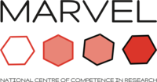

[](https://travis-ci.org/marvel-nccr/quantum-mobile)

# Quantum Mobile

## What is Quantum Mobile

*Quantum Mobile* is a Virtual Machine for computational materials science.

It comes with a collection of software packages for quantum
mechanical calculations, including

 * [Quantum ESPRESSO](http://www.quantum-espresso.org/)
 * [Yambo](http://www.yambo-code.org/)
 * [fleur](http://www.flapw.de/)
 * [Siesta](https://launchpad.net/siesta)
 * [CP2K](https://www.cp2k.org)
 * [Wannier90](http://www.wannier.org)

all of which are set up and ready to be used through on their own or through the
[AiiDA](http://www.aiida.net) python framework for automated workflows and
provenance tracking.

You can run Quantum Mobile on your Windows, MacOS or Linux computer using the
[VirtualBox](http://virtualbox.org/) software.
You can also
[install Quantum Mobile on virtual machines using cloud services](https://github.com/materialscloud-org/ansible-playbook-workhorse)
like Amazon Web Services or OpenStack.


## Download the VM

Please see [releases](https://github.com/marvel-nccr/quantum-mobile/releases)
for the latest VM image and installation instructions.

For issues encountered during installation of the VM, see the
[FAQ](https://github.com/marvel-nccr/quantum-mobile/wiki/Frequently-Asked-Questions).

## Build it from scratch

You would like to add/remove some components of the VM
and produce your own modified VM image?

This git repository contains all the vagrant and ansible scripts required to
set up the VM from scratch (note: [plan >1h](other_stuff/timings.txt) for
this).

### Prerequisites

- [vagrant](https://www.vagrantup.com/downloads.html) >= 2.0.1
- [virtualbox](https://www.virtualbox.org/wiki/Downloads)
- [python](https://www.python.org/)
- Host OS: Building Quantum Mobile has been tested on MacOS, Ubuntu
  and Windows (see [instructions](https://github.com/marvel-nccr/quantum-mobile/wiki/Instructions-for-building-Quantum-Mobile)).

### Create Virtual Machine

```
git clone https://github.com/marvel-nccr/quantum-mobile.git
cd quantum-mobile
pip install -r requirements.txt
ansible-galaxy install -r requirements.yml
vagrant plugin install vagrant-vbguest  # optional, improves interface
vagrant up  # build vm from scratch (takes some tens of minutes)
```

Note: Due to a bug in the vbguest vagrant plugin, there are some additional steps #60

### Create image
```
# optional: reduce size of VM
ansible-playbook playbook.yml --extra-vars "clean=true"
./compact_hd.sh

./create_image.sh
```

### Useful commands

 * `vagrant provision --provision-with ansible`: re-run ansible scripts
 * `vagrant reload`: restart machine
 * `vagrant halt`: stop machine
 * `ANSIBLE_ARGS="-twannier90" vagrant provision --provision-with=ansible`: run ansible scripts for the `wannier90` tag
 * ```
   ./setup-ansible.sh             # inform ansible about ssh config
   ansible-playbook playbook.yml  # run ansible directly, add tags, ...
   ansible-playbook playbook.yml  --tags wannier90
   ```
 * `ssh -F vagrant-ssh default`
 * `scp -F vagrant-ssh default:/path/on/vm  my/path`
 * ```./reconnect_vagrant.sh  # reconnect vagrant to an old VM```
 * `ansible-galaxy install -r requirements.yml --ignore-errors`

## Customizing Quantum Mobile

There are at least two ways to customize Quantum Mobile in order to fit your needs:

 1. Start VM, add/remove components manually, export image again
   + it's quick
   + no need to work with ansible/vagrant
   - **but**: no clear record of changes
   - need to redo this next time round
 2. Add/remove components in the [`playbook.yml`](playbook.yml), rebuild the VM
   + it's reproducible
   + easy to keep up to date (just rebuild with updated components)
   - **but**: need to learn how to build the VM

Quantum Mobile encapsulates components in
[ansible roles](https://docs.ansible.com/ansible/latest/user_guide/playbooks_reuse_roles.html)
which are selected in the [`playbook.yml`](playbook.yml) file.
You can choose from our [growing repository of roles](https://galaxy.ansible.com/marvel-nccr) or [write your own](https://github.com/marvel-nccr/cookiecutter-ansible-role).

## Publishing customized VMs

If you would like to publish a customized version of Quantum Mobile, we recommend that you

 1. Fork this repository
 1. Give your VM a different name to avoid confusion
 1. Adapt `globalconfig.yml`, `EULA.txt` and `README.md` appropriately
 1. Pull the latest changes from time to time to keep things up to date

Note: If you are developing new ansible roles for computational materials
science applications and would like to make them easier to find,
we'd be happy to host them under the marvel-nccr github organisation
- just [drop us a line](mailto:leopold.talirz@gmail.com).

## Contact

Please direct inquiries regarding Quantum Mobile to the [AiiDA mailinglist](http://www.aiida.net/mailing-list/)

For issues encountered during installation of the VM, see the [FAQ](https://github.com/marvel-nccr/quantum-mobile/wiki/Frequently-Asked-Questions).

## Acknowledgements

This work is supported by the [MARVEL National Centre for Competency in Research](http://nccr-marvel.ch)
funded by the [Swiss National Science Foundation](http://www.snf.ch/en),
as well as by the [MaX European Centre of Excellence](http://www.max-centre.eu/) funded by
the Horizon 2020 EINFRA-5 program, Grant No. 676598.



