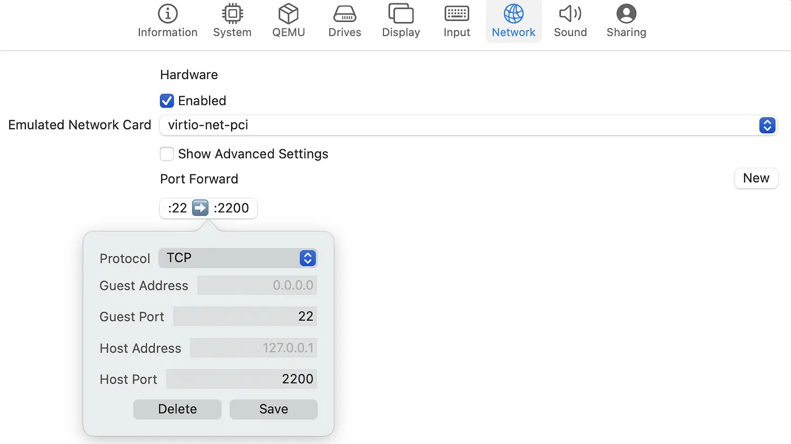

# Build for Apple Silicon

Apple Silicon is the new CPU architecture for Apple Macs. 
The new architecture is based on ARM64, which means that software compiled for x86_64 will not run on Apple Silicon without translation. 
VirtualBox does not yet support Apple Silicon, so instead we use a different virtualization software called [UTM](https://mac.getutm.app/).

## Prerequisites

To build the UTM image, first:

- install the latest version of UTM [from the Apple store](https://apps.apple.com/us/app/utm-virtual-machines/id1538878817).
- download the "64-bit ARM (ARMv8/AArch64) server install image" from https://cdimage.ubuntu.com/releases/focal/release/.


Then, clone the `quantum-mobile` repository:

```console
git clone https://github.com/marvel-nccr/quantum-mobile.git
cd quantum-mobile
```

Create a fresh Python environment with a manager of your choosing and simply install `tox`:

```
pip install tox
```

Finally, we need the `sshpass` tool to have password access to the VM when running the Ansible playbook:

```console
brew install hudochenkov/sshpass/sshpass
```

## Install and start the VM 

Create a new virtual machine from the downloaded Ubuntu server ISO using "File -> New".
Select the following:

- Virtualize
- Operating system: Select Custom -> Other, then use "Browse" to find the ISO image and continue.
- select the following hardware/storage settings: 4096MB RAM (default), 4 CPU cores and 64GB disk space (default).

Next, **create** (be careful not delete the existing one, it is used for connecting the internet) a new network setting with type "Emulated VLAN" and forward port 22 to 2200 of localhost so you can ssh to VM from localhost.
Check [here](https://github.com/utmapp/UTM/discussions/2465#discussioncomment-6931047) for detailed instructions.



Finally. run the VM and follow the installation instructions.
In most steps you can take the default option, keeping in mind the following exceptions:

- Remember to install OpenSSH server during setup, so we can ssh to the VM during the Ansible deployment. 
- Create system user `max` with password `moritz` and enable auto login. 

**Important**: Once the installation is complete, select reboot and then _shut down the VM_.
Rebooting with the ISO image still selected for the CD/DVD input will result in the installation process starting again.
Hence, unselect the image before booting the machine after the installation.

## Configure the VM with Ansible

Set the following SSH configuration in the `~/.ssh/config`:

```
Host qmobile
  HostName 127.0.0.1
  User max
  Port 2200
```

In the localhost (control machine), activate the Python environment and run the Ansible playbook in the root directory of the repository:

```
BUILD_PLAYBOOK=playbook-aiidalab-qe.yml tox -e ansible -- --extra-vars "build_hosts=utm" -kK
```

It will ask for the password of the `max` user, which should be `moritz`.

## Troubleshooting

### Import from UTM copy

- If you see "Failed to access data from shortcut", try the methods from https://github.com/utmapp/UTM/discussions/3774

### Failing to connect via SSH using password

In case you run into the following error:

```
fatal: [utm]: FAILED! =>
  msg: to use the 'ssh' connection type with passwords, you must install the sshpass program
```

It means that the `sshpass` tool has not been installed correctly using:

```
brew install hudochenkov/sshpass/sshpass
```