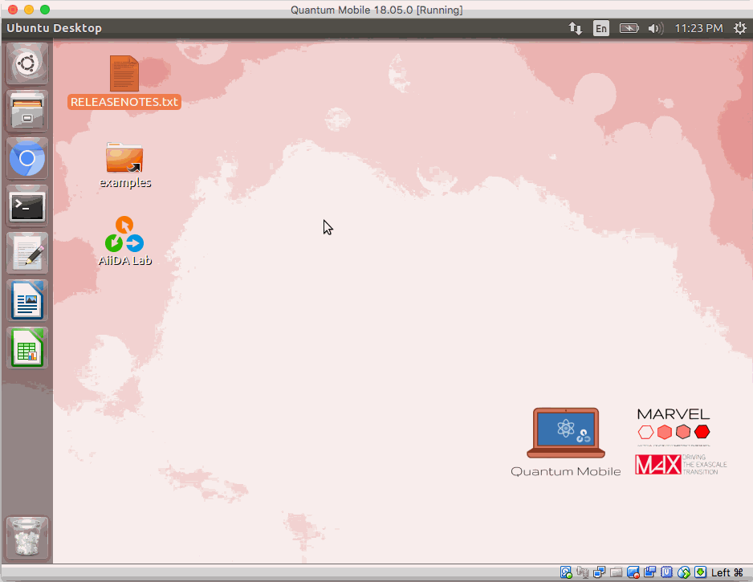

# Quantum Mobile

## What is Quantum Mobile

*Quantum Mobile* is a Virtual Machine for computational materials science.

It comes with a collection of software packages for quantum mechanical calculations, including:

- [Quantum ESPRESSO](http://www.quantum-espresso.org/)
- [Yambo](http://www.yambo-code.org/)
- [fleur](http://www.flapw.de/)
- [Siesta](https://gitlab.com/siesta-project/siesta)
- [CP2K](https://www.cp2k.org)
- [Wannier90](http://www.wannier.org)
- [BigDFT](http://www.bigdft.org)

all of which are set up and ready to be used on their own or through the
[AiiDA](http://www.aiida.net) python framework for automated workflows and
provenance tracking.

## Quantum Mobile Flavours

Quantum Mobile VMs are built using a set of automated steps *via* [ansible](https://www.ansible.com/).
You can [build a VM yourself](./developers/build-vagrant.md), or use one of the pre-built images:

```{panels}

{fa}`desktop,mr-1` Desktop Edition
^^^^^^^^^^^^^^^^^^^^^^^^^^^^^

Comes with the familiar Ubuntu Desktop and runs on your Windows, MacOS or Linux computer using the [VirtualBox](http://virtualbox.org/) software.

The Desktop Edition is tailored to provide students with a familiar working environment.

+++
[**Download release**](releases/index.md)
---

{fa}`cloud,mr-1` Cloud Edition
^^^^^^^^^^^^^^^^^^^^^^^^^^^^^^

Intended for use on servers using cloud services like Amazon Web Services, Google Cloud, or OpenStack.

The Cloud Edition targets advanced users who are familiar with the command line & SSH and prefer to run calculations on a remote server.

+++
[**Download release**](releases/index.md)
```

## Demonstration




## Acknowledgements

This work is supported by the [MARVEL National Centre for Competency in Research](http://nccr-marvel.ch)
funded by the [Swiss National Science Foundation](http://www.snf.ch/en),
as well as by the [MaX European Centre of Excellence](http://www.max-centre.eu/) funded by
the Horizon 2020 EINFRA-5 program, Grant No. 676598.


```{toctree}
:hidden: true

releases/index.md
```

```{toctree}
:hidden: true
:maxdepth: 1
:caption: Users

users/launch.md
users/faq.md
users/troubleshoot.md
```

```{toctree}
:hidden: true
:maxdepth: 1
:caption: Developers

developers/customize.md
developers/build-vagrant.md
developers/build-cloud.md
developers/roles.md
```

```{toctree}
:hidden: true
:maxdepth: 1
:caption: Maintainers

maintainers/develop.md
```
