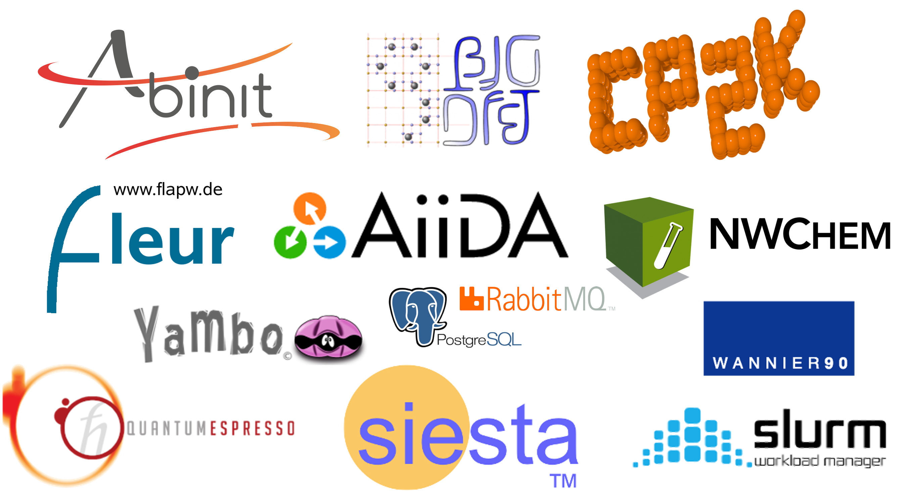
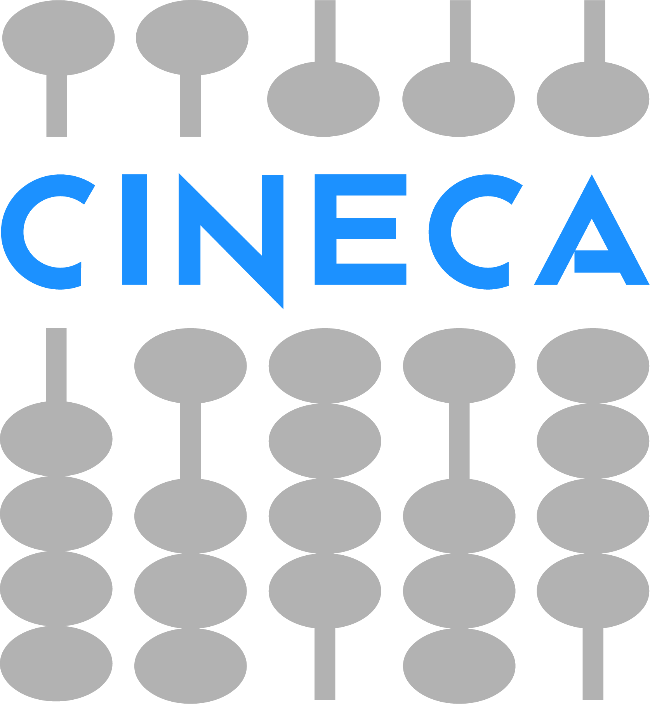
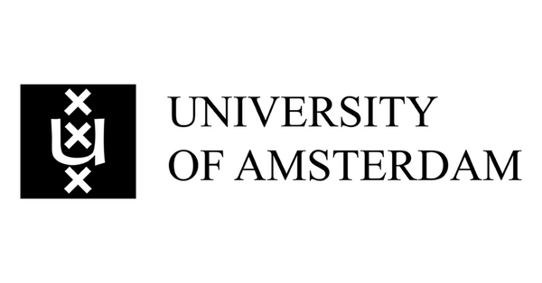
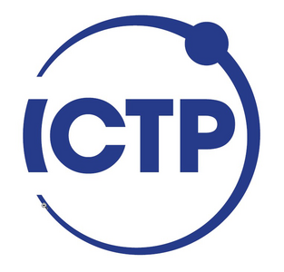
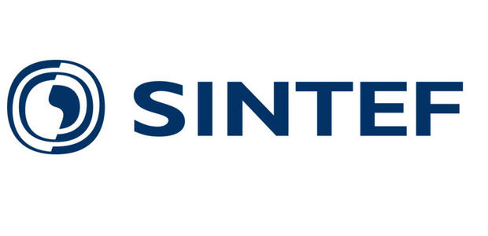
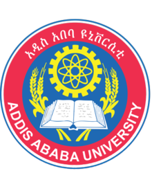

# Quantum Mobile



## What is Quantum Mobile

Quantum Mobile is a Virtual Machine for computational materials science.

Quantum Mobile provides a uniform environment for quantum mechanical materials simulations. Simulation codes are set up and ready to be used either directly or through the [AiiDA](http://www.aiida.net) python framework for automated workflows and provenance tracking.

Open source throughout
: Based on [Ubuntu Linux](http://releases.ubuntu.com/18.04/)

Pre-built images
: Available for Linux, MacOS or Windows computers, using VirtualBox. Or deploy on cloud services like OpenStack or Amazon Elastic Compute Cloud using [ansible](https://www.ansible.com/).

Simulation codes pre-installed
: [Abinit](https://www.abinit.org), [BigDFT](http://www.bigdft.org), [CP2K](https://www.cp2k.org), [Fleur](http://www.flapw.de/), [Quantum ESPRESSO](http://www.quantum-espresso.org/), [Siesta](https://gitlab.com/siesta-project/siesta), [Wannier90](http://www.wannier.org), [Yambo](http://www.yambo-code.org/), together with [AiiDA](http://www.aiida.net/), [JupyterLab](https://jupyterlab.readthedocs.io), and the [AiiDAlab](https://www.materialscloud.org/aiidalab/) Jupyter environment.

Tools pre-installed
: atomistic (xcrysden, jmol, cif2cell, ase, pymatgen, seekpath, spglib, pycifrw), visualization (grace, gnuplot, matplotlib, bokeh, jupyter), simulation environment (slurm, OpenMPI, FFT/BLAS/LAPACK, gcc, gfortran, singularity).

Modular setup
: with individually tested [ansible roles](https://galaxy.ansible.com/marvel-nccr). Build your own flavour tailored to your use case.

## Quantum Mobile Flavours

Quantum Mobile VMs are built using a set of automated steps *via* [ansible](https://www.ansible.com/).
You can [build a VM yourself](./developers/build-vagrant.md), or use one of the pre-built images:

::::{grid} 1 2 2 2
:gutter: 1 2 2 2

:::{grid-item-card} {fa}`desktop;sd-mr-1` Desktop VirtualBox

Comes with the familiar Ubuntu Desktop and runs on your Windows, MacOS or Linux computer using the [VirtualBox](http://virtualbox.org/) software.

The Desktop Edition is tailored to provide students with a familiar working environment.

+++
[**Download release**](releases/index.md)

:::
:::{grid-item-card} {fa}`cloud;sd-mr-1` Cloud Image

Intended for use on servers using cloud services like Amazon Web Services, Google Cloud, or OpenStack.

The Cloud Edition targets advanced users who are familiar with the command line & SSH and prefer to run calculations on a remote server.

+++
[**Download release**](releases/index.md)

:::
::::


## Testimonials

```{epigraph}
Compared to [courses of] previous years, the overhead due to technical problems and misunderstandings has been greatly reduced. Quantum Mobile is absolutely the right tool to have.

-- Stefaan Cottenier, [compmatphys.org](http://compmatphys.epotentia.com/)
```

```{epigraph}
Quantum Mobile is really a fantastic tool! I do think that it really gives a gigantic help for the organisation of Schools focusing on simulation codes.

-- Andrea Marini, founder of the [Yambo code](http://www.yambo-code.org/)
```

```{epigraph}
We run a class on computational quantum mechanics and DFT where we have started using Quantum Mobile. Very useful and effective!

-- Andrea Ferretti, Researcher [S3 Center, Istituto Nanoscienze, CNR](http://www.nano.cnr.it/)
```

Quantum Mobile has been used, amongst others, in the following schools and courses:

- [Understanding Advanced Molecular Simulations](https://edu.epfl.ch/coursebook/en/understanding-advanced-molecular-simulation-CH-420) (2018, EPFL, Switzerland)
- [Computational Methods in Molecular Quantum Mechanics](https://edu.epfl.ch/coursebook/en/computational-methods-in-molecular-quantum-mechanics-CH-452) (2018, EPFL, Switzerland)
- [MolSim school](http://www.acmm.nl/molsim/molsim2019/) (2019, Amsterdam, Netherlands)
- [Molecular and Materials Modelling](http://www.vvz.ethz.ch/Vorlesungsverzeichnis/lerneinheit.view?lerneinheitId=120724&semkez=2018S&ansicht=KATALOGDATEN&lang=en) (2018, ETH Zurich, Switzerland)
- [Computational Materials Physics online course](https://compmatphys.org/) (University of Ghent, Belgium)
- [Ethiopia School on Electronic Structure Methods](https://agenda.ethernet.edu.et/event/33/) (2019, Addis Ababa, Ethiopia)
- [Computational School on Electronic Excitations in Novel Materials Using the Yambo Code](http://indico.ictp.it/event/9018/) (2020, Trieste, Italy)
- [Wannier90 v3.0 school](https://www.materialscloud.org/learn/sections/C8ad91/wannier90-v3-0-school-virtual-edition-2020), virtual edition 2020
- [AiiDA tutorials](https://aiida-tutorials.readthedocs.io) in Switzerland, Italy, Slovenia, China, Japan, India, Norway, ...

::::::{grid} 4 6 6 6
:gutter: 3
:padding: 1

:::{grid-item} [](https://www.cineca.it/en)
:::
:::::{grid-item}
::::{grid} 1
:::{grid-item} [](https://www.epfl.ch/en/)
:::
:::{grid-item} [](https://ethz.ch/en.html)
:::
::::
:::::
:::::{grid-item}
::::{grid} 1
:::{grid-item} [](https://en.xmu.edu.cn/)
:::
:::{grid-item} [](https://www.uva.nl/en)
:::
::::
:::::
:::{grid-item} [](https://www.ugent.be/en)
:::
:::{grid-item} [](https://www.ictp.it/)
:::
:::{grid-item} [](https://www.ijs.si/ijsw/JSI)
:::
:::{grid-item} [](http://www.iitmandi.ac.in/)
:::
:::{grid-item} [](https://www.sintef.no/en/)
:::
:::{grid-item} [](http://www.aau.edu.et/)
:::
:::{grid-item} [](https://www.univ-dschang.org/)
:::
:::{grid-item} [](https://www.u-tokyo.ac.jp/en/index.html)
:::
::::::

## Acknowledgements

This work is supported by the [MARVEL National Centre for Competency in Research](http://nccr-marvel.ch)
funded by the [Swiss National Science Foundation](http://www.snf.ch/en),
as well as by the [MaX European Centre of Excellence](http://www.max-centre.eu/) funded by
the Horizon 2020 EINFRA-5 program, Grant No. 676598.

::::{subfigure} AAABB|AAACC
:gap: 8px


::::

```{toctree}
:hidden: true

releases/index.md
```

```{toctree}
:hidden: true
:maxdepth: 1
:caption: Users

users/launch.md
users/use.md
users/faq.md
users/troubleshoot.md
```

```{toctree}
:hidden: true
:maxdepth: 1
:caption: Developers

developers/customize.md
developers/build-vagrant.md
developers/build-cloud.md
developers/build-apple-silicon.md
developers/roles.md
```

```{toctree}
:hidden: true
:maxdepth: 1
:caption: Maintainers

maintainers/develop.md
maintainers/release.md
```
