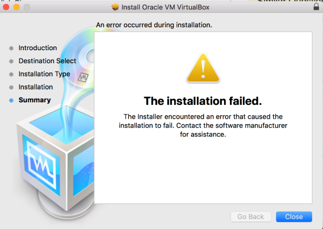
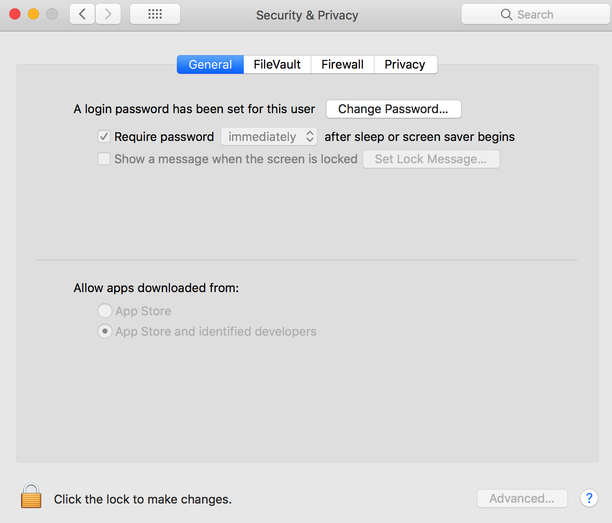
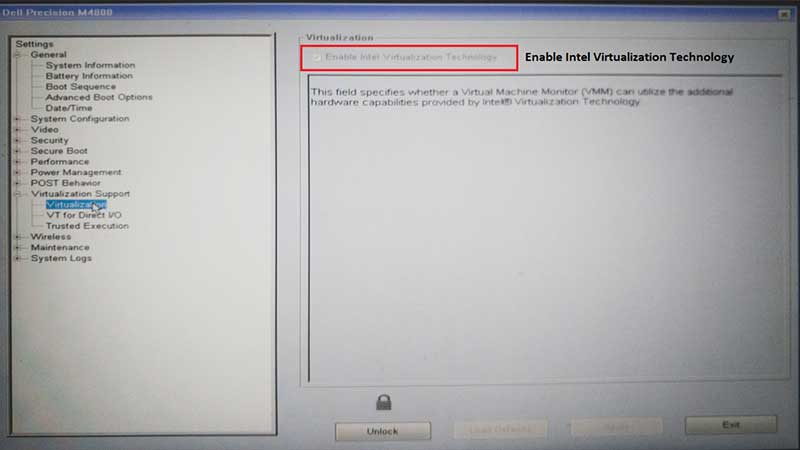

# Troubleshooting

:::{note}
If the following sections to not solve your issue,
please direct further inquiries to the [AiiDA mailinglist](http://www.aiida.net/mailing-list/)
:::

## VirtualBox installation / start-up

### Downloading over an unstable network

If your network connection is unstable or very slow and you are unable to download the Quantum Mobile image in one go, consider using a download manager that can resume downloads, [such as the `curl` / `wget` command line utilities](https://superuser.com/a/529951/345438).

### Importing the VM results in an error: `NS_ERROR_INVALID_ARG (0x80070057)`

This [may indicate that your hard disk is full](https://www.virtualbox.org/ticket/18343).
Do you have enough disk space to accommodate both the Quantum Mobile image *and* the extracted image (sizes reported in the [installation instructions of the release](https://github.com/marvel-nccr/quantum-mobile/releases)?

### Running the VM yields an error: `VMDK: Compressed image is corrupted`

Your image file is corrupted - try downloading it again.

You can verify the integrity of the image by computing its md5 hash (`md5sum <filename>`) and comparing the result to the hash provided on the [release page](https://github.com/marvel-nccr/quantum-mobile/releases).

### Running the VM yields: `VT-x is disabled in the BIOS for all CPU modes (VERR_VMX_MSR_ALL_VMX_DISABLED)`

Enable Virtualization Technology (VTx) and Virtualization Technology Directed I/O (VTd) in your BIOS.

### I start the Quantum Mobile, but I only get a black screen

You probably have VirtualBox version 5. You need VirtualBox 6.x to run Quantum Mobile. Upgrade your VirtualBox and try again.

### Running the VM used to work fine, but recently you start getting errors `RTR3InitEx failed`

The VirtualBox kernel modules do not match this version of VirtualBox.
Executing '/sbin/vboxconfig' may correct this.

The kernel of your host OS may have been updated since the installation of VirtualBox. Follow the instructions above in order to recompile the VirtualBox kernel extensions.

### On Ubuntu hosts, you get an error: `Kernel driver not installed`

Stackoverflow has [some help](https://askubuntu.com/questions/920689/how-to-fix-modprobe-vboxdrv-error-in-virtualbox) on this.

### Installation of VirtualBox fails on recent versions of macOS

1. Go to System Preferences => Security & Privacy
2. Click on the 'General' tab on the top left
3. Click the ‘Allow’ button at the bottom right ('Some system software was blocked from loading').
4. Select 'Oracle' among the developers not to be blocked; click 'OK'
5. Re-run the installer.

[More detailed instructions by Matthew Palmer](https://matthewpalmer.net/blog/2017/12/10/install-virtualbox-mac-high-sierra/index.html).

### Installation of VirtualBox fails on Windows

If you are trying to create a new virtual machine using VirtualBox on Windows 10 or any other Windows versions, you may get an error as below:

> Not in a hypervisor partition (HVP=0)(VERR_NEM_NOT_AVAILABLE).
> VT-x is disabled in the BIOS for all CPU modes (VERR_VMX_MSR_ALL_VMX_DISABLED).

See this page for the fix: <https://techsupportwhale.com/not-in-a-hypervisor-partition/>:

1. In Windows machine go to Settings -> Update & Security -> Recovery. There is a Restart Now option as highlighted under Advanced startup.
2. Once the Restart Now is clicked the below options need to be followed in sequence: Troubleshoot → Advanced option → UEFI Firmware Settings → Restart
3. Once the restart is clicked the system enters BIOS mode. In the BIOS look for option Virtualization which is under Advanced or System Configuration for most of the computers. Change it to enabled.
4. Once done you can exit with save (F10 is the shortcut for most of the computers).

## VirtualBox Runtime (performance, graphics, ...)

**IMPORTANT** Preliminary tests indicate that VirtualBox 6.1 (released Dec 10th, 2019) addresses at least one of the long-standing graphics issues. Please upgrade.

### In xcrysden (and other software using OpenGL), menus are hidden behind the 3d canvas

Unfortunately, this is an [open VirtualBox issue](https://www.virtualbox.org/ticket/11596#comment:4). Workaround is to disable 3d acceleration:

1. stop VM
2. Machine => Settings => Display => Untick "Enable 3d acceleration"  

### On macOS hosts, the content of the VirtualBox window stays in place when dragging it using the window bar

Minimize the window and maximize it again.

### On VirtualBox 6, [graphics becomes super slow after a few minutes](https://jsephler.co.uk/slow-laggy-poor-graphics-performance-linux-guest-virtualbox-6-0/)

1. stop VM
2. Machine => Settings => Display => Graphics Controller => Select "VMSVGA"

### VM interrupts WiFi connection and asks for password of `vagrant` user

Password is `vagrant`.

### VM not able to connect to internet on cable connection

(network icon in bottom right corner shows `ADAPTER NAT 1: cable disconnected`)

1. stop VM
2. Machine => Settings => Network => Tick "Cable Connected"

## Python / Jupyter Issues

- If you get errors `ImportError: No module named aiida` or `No command ’verdi’ found`,
  double check that you have loaded the virtual environment with `workon aiida` before using `python` or `verdi`,
  or use `workon jupyter` before launching a `jupyter` notebook server.
